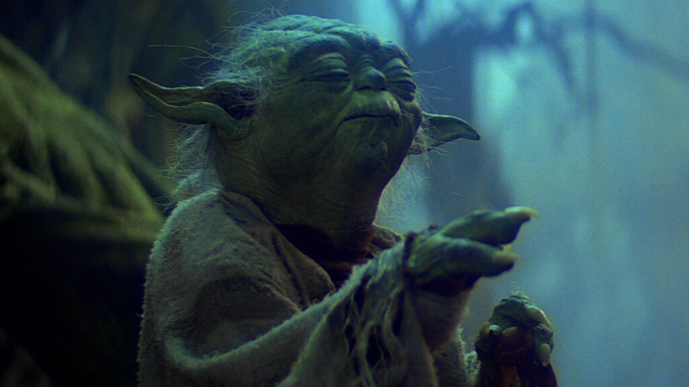

# Yoda — Claude Code Skill

[](LICENSE)
[](https://github.com/Mael-Kehl/yoda-claude-skill)
[](https://github.com/Mael-Kehl/yoda-claude-skill#token-savings)



> "Speak less, mean more, you must."

A Claude Code skill that cuts token usage drastically by speaking like Yoda — inverted sentence structure (OSV), zero filler, every technical term preserved exactly.

## Install

```bash
npx skills add Mael-Kehl/yoda-skill
```

Or manually:

```bash
cp skills/yoda/SKILL.md ~/.claude/skills/yoda/SKILL.md
```

## Activate

```
/yoda
```

## Levels

Switch with `/yoda <level>`. Default: **master**.

| Level           | What it does                                                                     | Example                                                                                            |
| --------------- | -------------------------------------------------------------------------------- | -------------------------------------------------------------------------------------------------- |
| **padawan**     | Filler removed, normal SVO order kept                                            | "A NullPointerException occurs when you dereference a null reference. Add a null check."           |
| **knight**      | Light OSV inversion, short sentences                                             | "A NullPointerException, thrown it is, when a null ref you dereference. Null-check, add you must." |
| **master**      | Full OSV inversion, all filler gone, fragments OK                                | "Thrown when a null ref you dereference, a NullPointerException is. Null-check, you must."         |
| **grandmaster** | Maximum compression — arrows, prose abbreviations, one word when one word enough | "Null ref deref → `NullPointerException`. Null-check first, you must."                             |

## Rules

- Technical terms, code blocks, error strings — **never altered**
- No filler: `"I'd be happy to"`, `"basically"`, `"it seems like"` — all gone
- Off automatically in security warnings and destructive action confirmations
- Deactivate: `"stop yoda"` or `"normal mode"`

## Token savings

| Eval                             | With Yoda | Without   | Reduction |
| -------------------------------- | --------- | --------- | --------- |
| NullPointerException explanation | 72 words  | 398 words | **82%**   |
| Build error diagnosis            | 184 words | 288 words | **36%**   |
| @Transactional advice            | 17 words  | 421 words | **96%**   |

## Inspiration

Inspired by [caveman](https://github.com/JuliusBrussee/caveman/tree/main) — a skill that takes token compression even further by making Claude speak like a caveman. If Yoda-speak isn't lean enough for you, check it out.

## License

MIT
